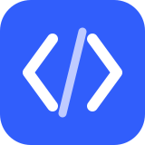

<div align="center">
  
  <h1>zakian-portfolio</h1>
  <p><strong>CV interaktif dan portfolio personal Zakian Maulana Syaifulloh</strong></p>
  <p>Website recruiter-facing yang memperkenalkan perjalanan, keahlian, pengalaman kerja, pendidikan, dan project yang pernah dibangun.</p>
  <p>
    <a href="https://github.com/zakianmaulana01/zakian-portfolio"></a>
    <a href="https://github.com/zakianmaulana01/zakian-portfolio"></a>
    
    
  </p>
</div>

## ✦ Tentang project ini

`zakian-portfolio` adalah website personal yang dibuat sebagai gabungan antara **CV digital** dan **portfolio project**. Alur halaman sengaja dimulai dari perkenalan diri, lalu membawa recruiter melihat keahlian, pengalaman kerja, pendidikan, dan hasil pekerjaan secara bertahap.

Desainnya memakai tema terang putih-biru dengan aksen editor kode agar terasa dekat dengan dunia pengembangan software, tetapi tetap nyaman dibaca seperti CV profesional. Seluruh konten ditulis dalam bahasa Indonesia dan informasi profesionalnya bersumber dari profil LinkedIn serta repository GitHub Zakian.

## ✨ Yang bisa dilihat recruiter

- **Perkenalan yang langsung jelas** — nama, role, lokasi, ringkasan, dan tombol untuk membuka CV.
- **Aksen coding yang punya fungsi** — editor `profil.ts` dan `stack.ts`, label teknologi, dan potongan kode yang membantu membangun karakter developer.
- **Animasi yang terus hidup** — efek mengetik role, editor melayang, orbit teknologi, alur workflow, linimasa karier, aliran data SCADA, transaksi POS, dan percakapan realtime.
- **Project dengan konteks** — setiap kartu menjelaskan tujuan, teknologi, highlight fitur, serta link langsung ke source code.
- **CV siap kirim** — route `/resume` memiliki layout CV bersih dan tombol `Cetak / Simpan PDF` dengan stylesheet A4.
- **Kontak yang mudah dijangkau** — email, LinkedIn, dan GitHub tersedia di bagian akhir halaman.
- **Responsif dan aksesibel** — navigasi mobile, native dialog untuk detail project, focus state, semantic HTML, dan dukungan `prefers-reduced-motion`.

## 🧩 Project yang ditampilkan

| Project                                                                             | Fokus                                                   | Teknologi utama                           |
| ----------------------------------------------------------------------------------- | ------------------------------------------------------- | ----------------------------------------- |
| [BAYARO POS](https://github.com/zakianmaulana01/REACTJS-LANDING-PAGE-BAYARO)        | Website produk UMKM dan simulator kasir interaktif      | React, TypeScript, Tailwind CSS, Motion   |
| [Industrial SCADA](https://github.com/zakianmaulana01/NEXTJS-PLC-MANY)              | Dashboard pemantauan dan editor visual sistem industri  | Next.js, React Flow, Recharts, TypeScript |
| [Laravel Multiuser Chat](https://github.com/zakianmaulana01/LARAVEL-CHAT-MULTIUSER) | Aplikasi percakapan realtime dengan role dan notifikasi | Laravel, Vue 3, MySQL, Pusher             |

> Ilustrasi pada kartu project adalah **visual konsep** berbasis HTML/CSS, bukan screenshot produk. Project SCADA memakai telemetri simulasi sesuai README repository publiknya.

## 🛠️ Teknologi dan struktur

| Bagian    | Pilihan                                                            |
| --------- | ------------------------------------------------------------------ |
| Framework | Next.js 16 App Router                                              |
| UI        | React 19, TypeScript, Tailwind CSS v4                              |
| Motion    | Motion untuk interaksi pointer dan CSS keyframes untuk loop visual |
| Ikon      | Phosphor Icons                                                     |
| Font      | Manrope dan Space Grotesk, disajikan lokal                         |
| Konten    | Data lokal tanpa database atau API key                             |

```text
src/
├── app/
│   ├── page.tsx              # Halaman utama CV + portfolio
│   ├── resume/page.tsx       # CV printable
│   ├── globals.css           # Design system, responsive layout, animation
│   └── opengraph-image.tsx   # Social preview putih-biru
├── components/
│   ├── developer-scenes.tsx  # Editor kode dan visual project
│   ├── projects.tsx          # Filter dan dialog detail project
│   ├── navigation.tsx        # Desktop + mobile navigation
│   └── contact.tsx            # Email copy dan kontrol motion
└── data/portfolio.ts         # Profil, experience, education, skills, projects
```

## 🚀 Menjalankan secara lokal

Butuh Node.js `20.9+`.

```bash
git clone https://github.com/zakianmaulana01/zakian-portfolio.git
cd zakian-portfolio
npm install
npm run dev -- --port 3001
```

Buka [http://127.0.0.1:3001](http://127.0.0.1:3001).

Perintah yang tersedia:

```bash
npm run dev       # Development server
npm run build     # Production build
npm run start     # Menjalankan hasil build
npm run lint      # Pemeriksaan ESLint
npm run typecheck # Pemeriksaan TypeScript
npm run test:e2e  # Browser test dengan Playwright
```

Pemeriksaan terakhir pada commit aktif: `build` dan `lint` berhasil.

## ✍️ Mengubah isi portfolio

Edit [src/data/portfolio.ts](./src/data/portfolio.ts) untuk mengganti nama, ringkasan, kontak, keahlian, pengalaman, pendidikan, dan project. Struktur visual utama ada di [src/app/page.tsx](./src/app/page.tsx), sedangkan warna, breakpoint, dan animasi ada di [src/app/globals.css](./src/app/globals.css).

Tema dibuat terang secara sengaja. Tombol animasi di footer dapat menjeda seluruh loop, dan browser dengan preferensi reduced motion akan otomatis melihat versi yang lebih tenang.

## 📈 Memperbarui kontribusi GitHub

Panduan untuk menarik kalender kontribusi resmi, termasuk aktivitas privat yang ditampilkan secara anonim, tersedia di [docs/github-contributions.md](./docs/github-contributions.md). Hasil ekspor mentah disimpan di folder lokal yang sudah masuk `.gitignore`.

## 📌 Catatan konten

- Profil profesional: [LinkedIn Zakian](https://www.linkedin.com/in/zakian-maulana-syaifulloh/)
- Source code dan avatar: [GitHub Zakian](https://github.com/zakianmaulana01)
- Email kontak diberikan langsung oleh pemilik portfolio.
- Tidak ada metrik performa, testimonial, sertifikasi, client, atau live demo yang ditambahkan tanpa sumber yang terverifikasi.

## 📬 Kontak

**Zakian Maulana Syaifulloh** · Web Developer / IT Programmer

- Email: [zakianmaulana2001@gmail.com](mailto:zakianmaulana2001@gmail.com)
- LinkedIn: [linkedin.com/in/zakian-maulana-syaifulloh](https://www.linkedin.com/in/zakian-maulana-syaifulloh/)
- GitHub: [github.com/zakianmaulana01](https://github.com/zakianmaulana01)
